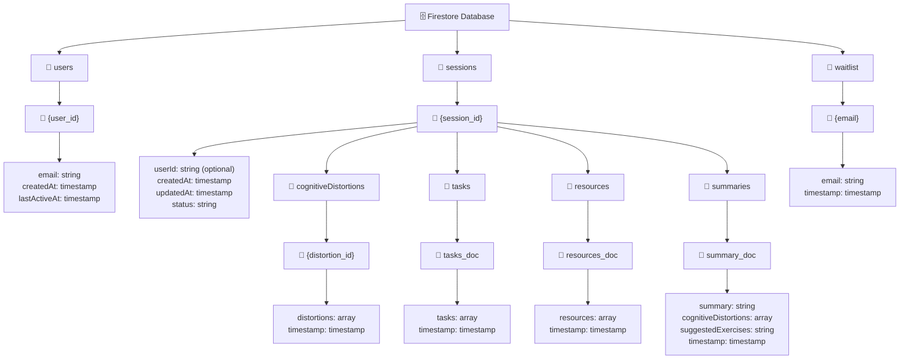

```mermaid
graph TD
    A["🗄️ Firestore Database"] --> B["📁 users"]
    A --> C["📁 sessions"]
    A --> D["📁 waitlist"]
    
    B --> B1["📄 {user_id}"]
    B1 --> B2["email: string<br/>createdAt: timestamp<br/>lastActiveAt: timestamp"]
    
    C --> C1["📄 {session_id}"]
    C1 --> C2["userId: string (optional)<br/>createdAt: timestamp<br/>updatedAt: timestamp<br/>status: string"]
    C1 --> C3["📁 cognitiveDistortions"]
    C1 --> C4["📁 tasks"]
    C1 --> C5["📁 resources"]
    C1 --> C6["📁 summaries"]
    
    C3 --> C3A["📄 {distortion_id}"]
    C3A --> C3B["distortions: array<br/>timestamp: timestamp"]
    
    C4 --> C4A["📄 tasks_doc"]
    C4A --> C4B["tasks: array<br/>timestamp: timestamp"]
    
    C5 --> C5A["📄 resources_doc"]
    C5A --> C5B["resources: array<br/>timestamp: timestamp"]
    
    C6 --> C6A["📄 summary_doc"]
    C6A --> C6B["summary: string<br/>cognitiveDistortions: array<br/>suggestedExercises: string<br/>timestamp: timestamp"]
    
    D --> D1["📄 {email}"]
    D1 --> D2["email: string<br/>timestamp: timestamp"]

```